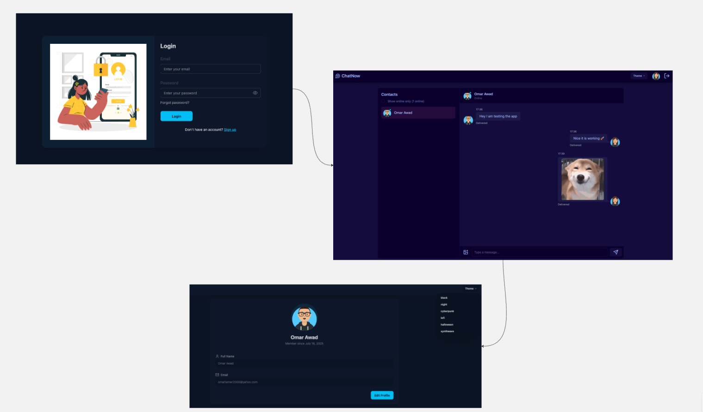

# ChatNow

**ChatNow** is a modern, full-stack real-time chat application that allows users to register, log in, and exchange messages (including images) with other users. It features live online status, profile management, and a beautiful, themeable UI. 

## Frontend

#### Frontend Tech Stack

- **React 19**
- **Vite** (build tool)
- **Zustand** (state management)
- **Tailwind CSS** & **DaisyUI** (styling and themes)
- **Socket.io-client** (real-time communication)
- **Axios** (HTTP requests)
- **React Router 7**
- **Day.js** (date formatting)
- **Lucide-react** (icons)
- **React Hot Toast** (notifications)

#### Frontend Key Features

- User authentication (register, login, logout)
- Real-time chat with online status
- Profile management (update name, email, avatar)
- Image upload in chat
- Multiple themes (dark, cyberpunk, etc.)
- Responsive and modern UI

## Backend

#### Backend Tech Stack

- **Node.js** & **Express 5**
- **MongoDB** (with **Mongoose**)
- **Socket.io** (real-time communication)
- **Cloudinary**/**Multer** (image uploads)
- **JWT** (authentication)
- **Bcrypt.js** (password hashing)
- **Morgan** (logging)
- **dotenv** (environment variables)

#### Backend Key Features

- RESTful API for user and message management
- JWT-based authentication with secure cookies
- Real-time messaging with Socket.io
- Image upload and storage via Cloudinary
- MongoDB for persistent storage
- Middleware for authentication and file uploads
- Follows Model-View-Controller (MVC) architecture for clean separation of concerns

## Environment Variables

| Name                    | Description                                   | Example Value                        |
| ----------------------- | --------------------------------------------- | ------------------------------------ |
| `PORT`                  | Port on which the backend server runs         | `3000`                               |
| `MONGODB_URI`           | MongoDB connection string                     | `mongodb://localhost:27017/careerly` |
| `JWT_SECRET`            | Secret key for JWT signing                    | `<your_jwt_secret>`                  |
| `CLOUDINARY_CLOUD_NAME` | Cloudinary account cloud name                 | `<your_cloud_name>`                  |
| `CLOUDINARY_API_KEY`    | Cloudinary API key                            | `<your_api_key>`                     |
| `CLOUDINARY_API_SECRET` | Cloudinary API secret                         | `<your_api_secret>`                  |
| `NODE_ENV`              | Node environment (`development`/`production`) | `development`                        |
| `FRONTEND_URL`          | URL of the frontend app for CORS              | `http://localhost:5173`              |

Be sure to create a `.env` file in the `backend/` directory with these variables

> [!NOTE]
> The frontend does not require any environment variables by default. All API requests are proxied to the backend via Vite’s dev server configuration.

## Setup Guide

### 1. Clone the Repository

```bash
git clone https://github.com/your-username/chatNow.git
cd chatNow
```

### 2. Install Dependencies

#### Backend

```bash
cd server
npm install
```

#### Frontend

```bash
cd ../client
npm install
```

### 3. Run the Backend

```bash
cd server
npm run dev
```

The backend will start on `http://localhost:3000`.

### 4. Run the Frontend

Open a new terminal window/tab:

```bash
cd client
npm run dev
```

The frontend will start on `http://localhost:5173` and proxy API requests to the backend.

## Screenshot


